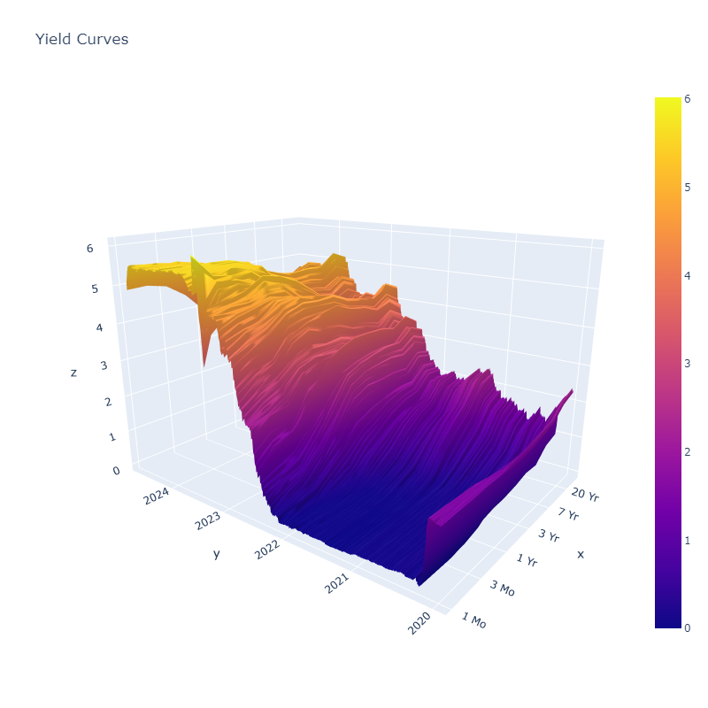

## Data Portfolio

--- 

[Surface View of Treasury Curve - Jupyter Notebook](https://github.com/jbeckford-data/Treasury-Curve/blob/main/Surface%20Plot%20of%20Treasury%20Curve.ipynb)

  
  
<!---
 

---
[Project 2 Title](/pdf/sample_presentation.pdf)

---
[Project 3 Title](http://example.com/)

---

### Category Name 2

- [Project 1 Title](http://example.com/)
- [Project 2 Title](http://example.com/)
- [Project 3 Title](http://example.com/)
- [Project 4 Title](http://example.com/)
- [Project 5 Title](http://example.com/)

---
--->
