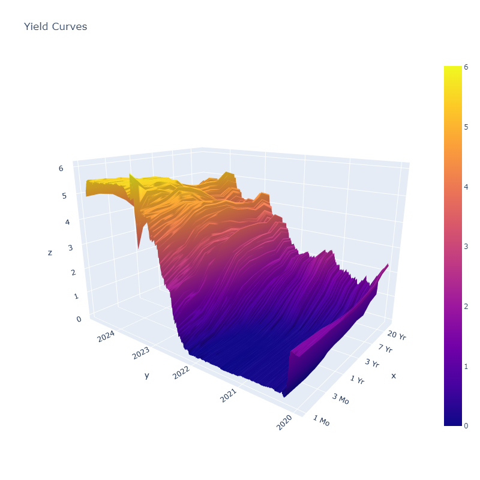

## Data Portfolio

[Surface View of Treasury Curve - Jupyter Notebook](/t_curve.md)

  
  

<!--  -->
<!--  -->

<!-- [Project 2 Title](/pdf/sample_presentation.pdf) -->
<!--  -->

<a href= "options_analyzer.html"> Options Analyzer Streamlit App </a>
<h3>Stock Options Payoff Analyzer</h3>

Robust tool for options traders and strategies

[QC Backtests: ETL & Dashboard Analysis](/QCBacktests.md)

A data analysis project demonstrating Extract, Transform, Load (ETL) processes and interactive dashboard visualizations for quantitative trading strategies.

    
This project showcases:

    <ul>
        <li>ETL pipelines for processing backtest results from QuantConnect</li>
        <li>Automated data cleaning and transformation workflows</li>
        <li>Interactive dashboards (using Plotly, Streamlit, and other tools)</li>
        <li>Performance metrics & visualizations (equity curves, drawdowns, risk/reward ratios)</li>
    </ul>
    
The project highlights how raw backtest data can be processed into actionable insights through structured data processing and visualization techniques.

