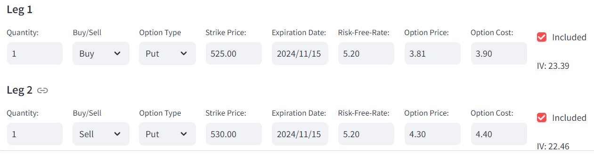
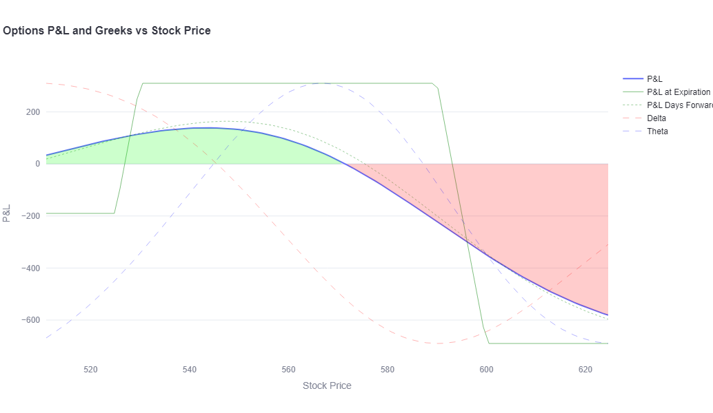

    <h2>Multi-Leg Options P&L Analyzer</h2>
    

        This analyzer, built as a Streamlit web app, is designed to help traders visualize the profit and loss (P&L) of multi-leg option strategies. 
        By leveraging <strong>yfinance,</strong> the app fetches real-time stock prices, enabling users to input options parameters such as strike price, expiration date, and option type (Call or Put).
     
    
     
        The tool employs the <strong>mibian</strong> library for calculating options pricing, implied volatility, and Greeks, providing a comprehensive overview of the options' potential outcomes.
    

    

        Users can define up to four legs in their options strategy, specifying details such as quantity, buy/sell, and option costs. 
        The application calculates cumulative P&L, Delta, and Theta for the selected strategies, visualizing the results using interactive charts created with <strong>Plotly</strong>. 
        Additionally, users can customize the display to include delta, theta, or days forward, enhancing their analytical experience. 
        Overall, this tool is invaluable for options traders seeking to evaluate and optimize their trading strategies effectively.
    

    
 
 
<a href= "https://options-analyzer-app.streamlit.app/"> Find the project here.

<strong>Note:</strong> - Directed to Streamlit Community Cloud

